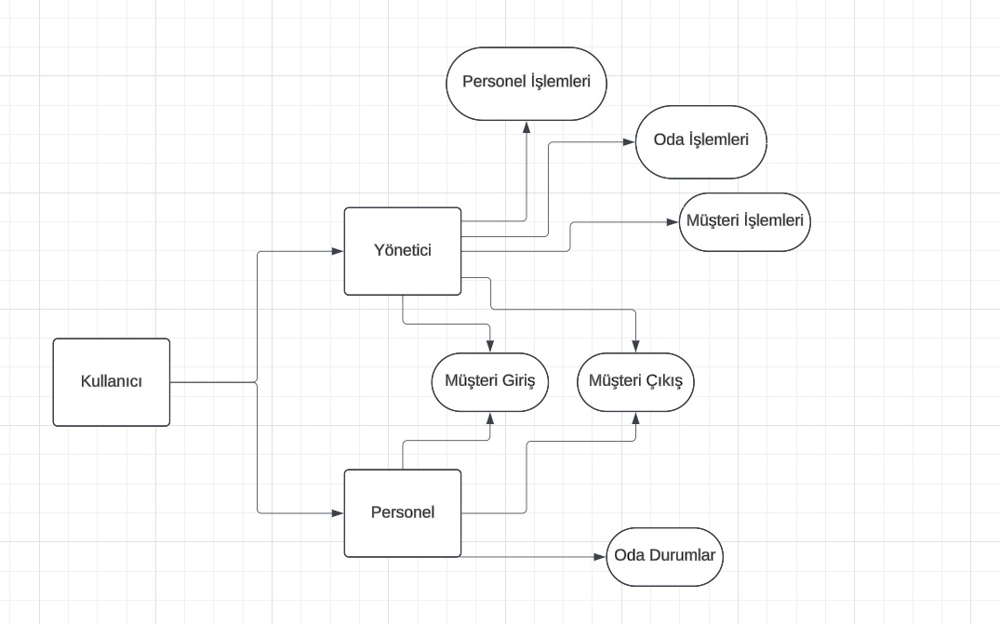
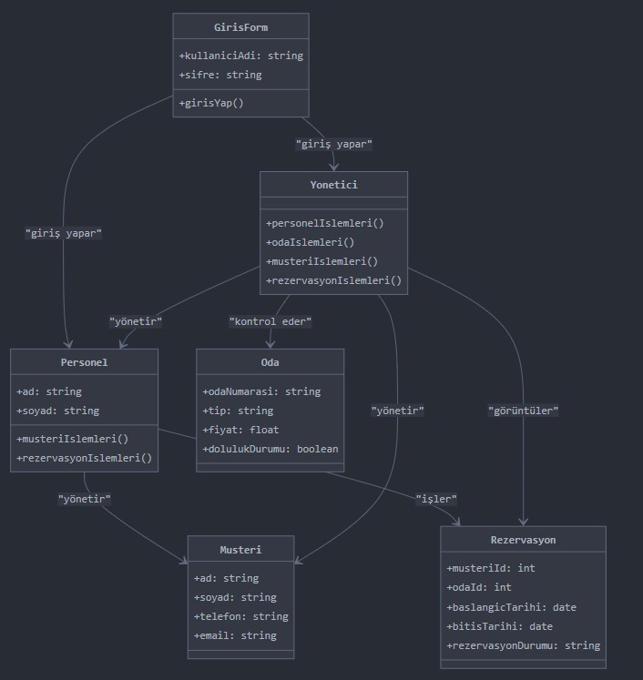
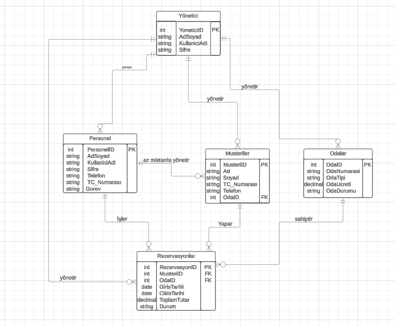

# Otel Yönetim Sistemi

Otel yönetim işlemlerini kolaylaştıran bir masaüstü uygulamasıdır. Bu proje, otel çalışanlarının oda durumlarını, müşteri giriş ve çıkış işlemlerini, rezervasyonları ve finansal raporlamayı kolaylıkla yönetebileceği bir platform sunar.

## 📌 Proje Özellikleri

- **Giriş ve Yönetici Paneli**: Kullanıcı doğrulaması ve yönetici işlevleri.
- **Oda Durumları**: Odaların doluluk, rezervasyon ve boş durumlarını görme ve yönetme.
- **Müşteri İşlemleri**: Müşteri giriş ve çıkış bilgilerini kayıt etme ve düzenleme.
- **Personel İşlemleri**: Personel bilgilerini görüntüleme, ekleme, güncelleme ve silme.
- **Oda İşlemleri**: Oda bilgilerini düzenleme ve oda durumlarını yönetme.
- **Finansal Durum**: Toplam gelir ve doluluk oranlarının görüntülenmesi.

---

## 📂 Kullanılan Teknolojiler

- **C#** (.NET Framework)
- **Windows Forms** (Masaüstü uygulama tasarımı)
- **MySQL** (Veritabanı)
- **Entity Layer**: Katmanlı mimari (DAL, BLL)
- **Responsive Tasarım**: Modern ve kullanıcı dostu arayüz.

---
## Diyagramlar

### Use-Case Diyagramı

### Class Diyagramı

### ER Diyagramı

---
## 📸 Ekran Görüntüleri

### Giriş Sayfası

 Giriş Sayfası, otel yönetim sistemi kullanıcılarının uygulamaya erişim sağlamasını ve yetkilerine göre doğru sayfaya yönlendirilmesini sağlar. Kullanıcı adı ve şifre bilgilerine göre, sistem ilgili kullanıcının bir Personel mi yoksa Yönetici mi olduğunu kontrol eder ve bu doğrultuda uygun sayfayı açar.

### Ana Menü

  Ana Menü, otel yönetim sistemi kullanıcılarının tüm sistem özelliklerine erişebileceği merkezi bir kontrol panelidir. Kullanıcılar yetkileri doğrultusunda çeşitli işlemleri bu ekran üzerinden gerçekleştirebilir. Personel ve Yönetici rolleri için uygun erişim izinleri sağlanmıştır.

### Oda Durumları

Oda Durumları, otelde bulunan tüm odaların durumunu (boş, dolu, rezervasyon) görselleştiren ve bu durumları hızlıca yönetmenizi sağlayan bir ekrandır. Bu ekran, oda numaralarını, oda tiplerini ve durum bilgilerini renk kodlarıyla gösterir. Personel bu ekran üzerinden odaların durumlarını kolayca takip edebilir.

### Müşteri İşlemleri

Müşteri İşlemleri ekranı, otelde konaklayan veya rezervasyon yaptıran tüm müşterilerin bilgilerinin yönetildiği bir ekrandır. Bu ekran üzerinden müşterilerle ilgili tüm işlemler (bilgi görüntüleme, düzenleme ve silme) hızlı ve kolay bir şekilde yapılabilir.

### Müşteri Giriş

Müşteri Giriş ekranı, yeni müşterilerin otel sistemine kaydedildiği ve odalara yerleştirildiği bir modüldür. Bu ekran, müşterinin kişisel bilgilerini, konaklama tarihlerini ve oda bilgilerini kaydederek otel yönetim sistemine ekler. Ayrıca giriş yapılan odanın durumu otomatik olarak güncellenir.

### Müşteri Çıkış

Müşteri Çıkış ekranı, otelden ayrılmak isteyen müşterilerin hesaplarını kapatma ve oda durumlarını güncelleme işlemlerinin yapıldığı bir modüldür. Bu ekran, müşterinin otel konaklamasına ilişkin toplam tutarını gösterir ve otelden çıkış işlemini tamamlar.

### Personel İşlemleri

Personel İşlemleri ekranı, otelde çalışan personelin yönetimini sağlayan bir modüldür. Bu ekran üzerinden personel ekleme, güncelleme ve silme işlemleri yapılabilir. Aynı zamanda mevcut personel bilgileri detaylı bir şekilde listelenir.

### Oda İşlemleri

Oda İşlemleri ekranı, oteldeki odaların yönetimini sağlayan bir modüldür. Bu ekran üzerinden oda ekleme, güncelleme ve silme işlemleri yapılabilir. Aynı zamanda mevcut odaların durum bilgileri detaylı bir şekilde listelenir.

---

## 🚀 Kullanım

1. Projeyi [indirin](https://github.com/ValeriiaShchorba/UludagOteli).
2. **Visual Studio** kullanarak projeyi açın.
3. Gerekli **MySQL bağlantı ayarlarını** `DatabaseHelper.cs` dosyasından yapılandırın.
4. Uygulamayı çalıştırın ve giriş ekranından kullanıcı bilgilerinizi girerek başlayın.

---

## 🛠️ Proje Yapısı

- **DAL (Data Access Layer)**: Veritabanı işlemleri.
- **BLL (Business Logic Layer)**: İş mantığı.
- **UI (User Interface)**: Windows Forms kullanıcı arayüzü.
- **MySQL**: Veritabanı bağlantı ve sorguları.

---

## ✨ Proje Hedefleri

- Otel işlemlerini dijitalleştirerek iş akışını hızlandırmak.
- Kullanıcı dostu arayüz ile kolay yönetim.
- Günlük, haftalık ve aylık raporlama.

---

## 📞 İletişim

Herhangi bir sorunuz veya öneriniz varsa lütfen benimle iletişime geçin:

- **Ad**: Valeriia
- **soyad**:Shchorba
- **Tel No**:+90 512 612 9787
- **E-posta**: valeriiashchorba@gmail.com
---
## ▶𝚈𝚘𝚞𝚝𝚞𝚋𝚎 Video
 Youtube proje tanıtım videosu izlemek için [tıklayın](https://www.youtube.com/watch?v=2Y3rhmwzuYo&t=14s)
